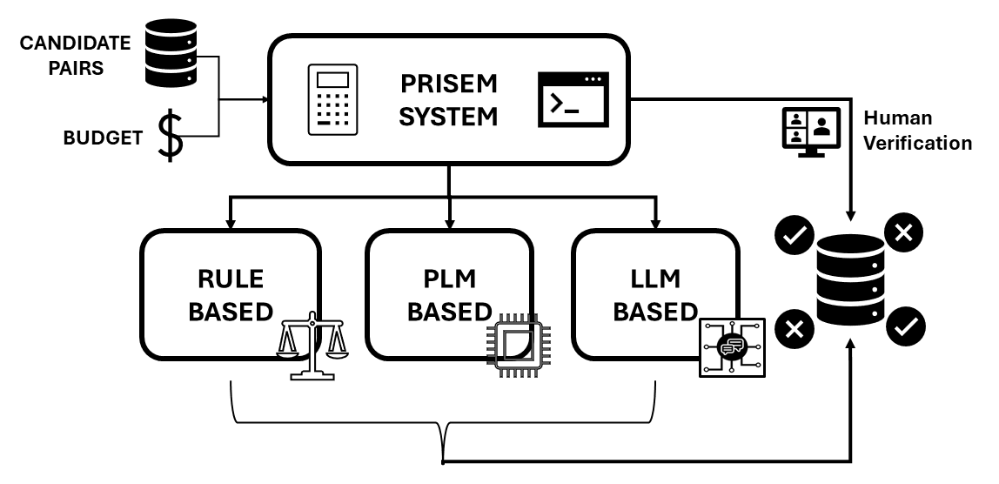

# PRISEM: Partitioning Resources for Intelligent Scalable Entity Matching
Code repository for the paper _Partitioning Resources for Intelligent Scalable Entity Matching_.

Entity Matching (EM), the task of determining whether two records refer to the same real-world entity, is a fundamental operation in data integration. Over time, EM techniques have evolved from similarity-based approaches to increasingly powerful methods based on Pretrained Language Models (PLMs) and, more recently, Large Language Models (LLMs). While these advances have improved matching performance, they have also introduced substantial differences in inference cost, creating challenges for practitioners operating under limited computational and financial resources. TO address this, we introduce **PRISEM**, a framework for budget-aware multi-method EM that allocates matching workloads across diverse EM agents with different cost-performance characteristics.

This work builds on the [DITTO](https://github.com/megagonlabs/ditto/tree/master) pipeline for fine-tuning a PLM for EM, utilizing its contained datasets. See the [data](data) folder for details.

## Requirements
The requirements for this repository are split into two parts: (1) requirements for the PLM/DITTO-based model training and (2) the requirements for the LLM/Jellyfish based model training. 

(1) DITTO Requirements

-----> Python 3.7.13, depenencies can be found in [requirements.txt](requirements.txt).

(2) Jellyfish Requirements

-----> Python 3.9.18, depenencies can be found in [requirements_jellyfish.txt](requirements_jellyfish.txt).

It is reccomended to create seperate virtual enviroments for both models, and to route accordingly via [run_prisem.sh](run_prisem.sh) and [run_jellyfish_worker.sh](run_jellyfish_worker.sh) per the example. 

## Quick Start
To run an allocation:
`./run_prisem <dataset> <budget> <allocation_method>`

For example:
`./run_prisem wdc_all_medium 10000 confidence`

The costs assigned to each method is the same as those described in the paper (Sim=0, RF=1, DITTO=2, Jellyfish=3). These can be modified in [run_prisem.sh](run_prisem.sh).

See [configs.json](configs.json) for the full list of available datasets to run.
